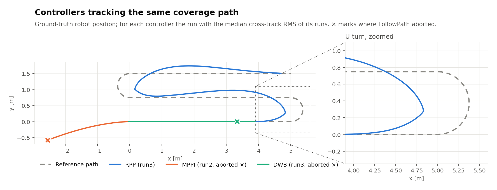

# Controller benchmark: first results

Path: 3 swaths × 5 m, 0.75 m spacing, semicircular U-turns (r = 0.375 m),
17.35 m in total. Each controller ran 3 times with its `config/nav2_*_fair.yaml`,
in a fresh headless simulation every time (`scripts/run_benchmark.py`). Mean ± std over the 3 runs:

| Metric | RPP | MPPI | DWB |
|---|---:|---:|---:|
| Runs (succeeded) | 3 (3) | 3 (0) | 3 (0) |
| Completion time [s] | 18.8 ± 0.1 | — (aborted at 8.2 ± 0.0) | — (aborted at 14.3 ± 0.0) |
| CTE RMS, swaths [cm] | 12.8 ± 0.2 | 148.6 ± 0.7 | 0.3 ± 0.0 |
| CTE max, swaths [cm] | 24.1 ± 0.4 | 261.0 ± 1.6 | 2.5 ± 0.1 |
| CTE RMS, turns [cm] | 21.2 ± 0.2 | n/a | n/a |
| CTE max, turns [cm] | 37.2 ± 0.1 | n/a | n/a |
| Yaw jerk RMS (cmd) [rad/s³] | 6.7 ± 0.2 | 0.5 ± 0.1 | 19.0 ± 0.4 |
| Yaw jerk events (cmd) [#] | 25 ± 2 | 0 ± 0 | 184 ± 10 |
| Yaw jerk RMS (odom) [rad/s³] | 18.9 ± 5.6 | 2.1 ± 0.4 | 20.6 ± 0.6 |
| Coverage [%] | 91.1 ± 0.1 | 1.8 ± 0.0 | 28.0 ± 0.2 |

## Reading the results

- **Only RPP completes the path.** It succeeds in all 3 runs, but cuts every
  U-turn short: it never gets past x ≈ 4.8 m, while the turn reaches x = 5.375 m.
  That is the cause of the 21 cm turn RMS and the 9 % uncut area, all of it at
  the swath ends. It also overshoots the second and third swaths by up to
  ~25 cm after each turn.
- **MPPI aborts in all 3 runs.** It reverses from the start, at up to
  `vx_min = -0.4` m/s, until the path falls out of its window ("Resulting plan
  has 0 poses"). Its numbers measure that failure, not tracking quality.
  Diagnosis so far: with `vx_min: 0.0` it does not move at all. With only the
  path critics enabled it still reverses, even on a single straight swath.
  So it is not a single misweighted critic, and the local costmap was fully free.
  This may be a bug in the RoboStack Nav2 build used here, so check it on the
  apt Humble install before treating it as an MPPI result.
- **DWB aborts in all 3 runs.** It tracks the first swath almost perfectly
  (0.3 cm RMS), then about 1 m before the first U-turn it starts rocking
  back and forth (`min_vel_x: -0.4`) until the progress checker gives up.
  The jerk figures come mostly from that rocking.
- Neither MPPI nor DWB reached a U-turn, so they have no turn metrics and the
  zoom only shows RPP.

## Setup notes

- Simulated with ROS 2 Humble / Nav2 1.1.17 / Gazebo 11 from RoboStack (conda)
  on Ubuntu 24.04, run with `use_lidar:=false`: Gazebo's ROS ray-sensor plugin
  crashes gzserver in that build. The field is empty and the costmaps stayed
  entirely free, so path following should not depend on the lidar.
- `/clock` is published at 100 Hz (`config/gazebo_params.yaml`, default 10 Hz)
  so sim-time stamps are fine enough to differentiate yaw rate.
- The robot position is ground truth (TF `map -> base_footprint`).
- The swath/turn split counts the last and first 1 m of each swath as part of
  the turn (`turn_margin`).
- Jerk events: samples with |yaw jerk| > 10 rad/s³ at 20 Hz.
- `/odom` jerk is noisier than `/cmd_vel` jerk because it differentiates the
  simulated contact dynamics twice.
- Coverage treats the cutter as a 0.75 m disc centred on `base_footprint`,
  which is at the rear axle.
- Raw data: `raw/summary.csv`, `raw/<run>_trajectory.csv`,
  `raw/<run>_reference.csv`, and the launch/recorder/client logs in `raw/logs/`.
